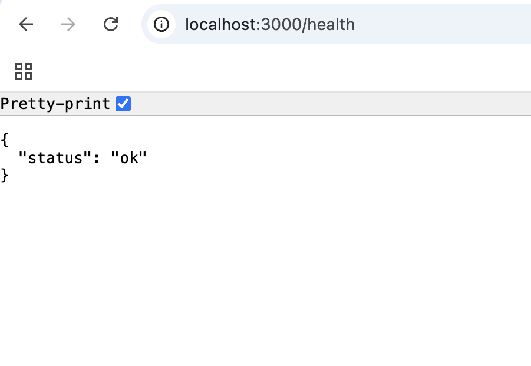
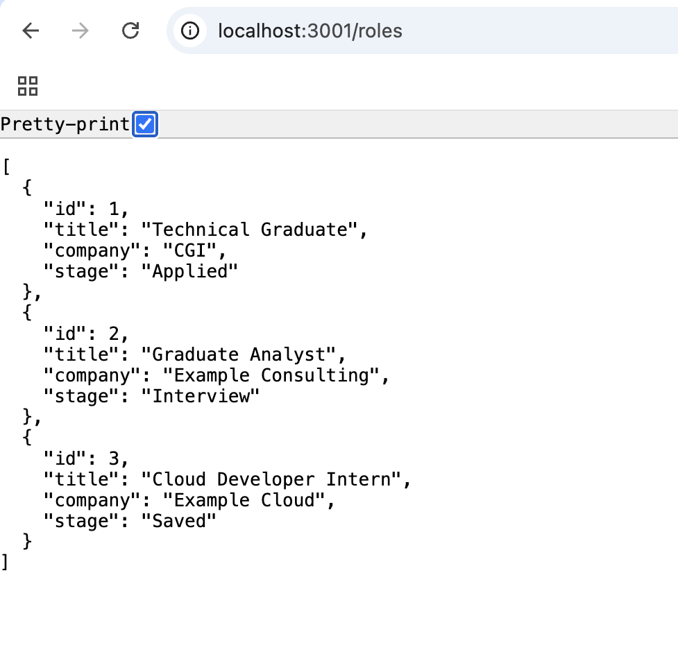
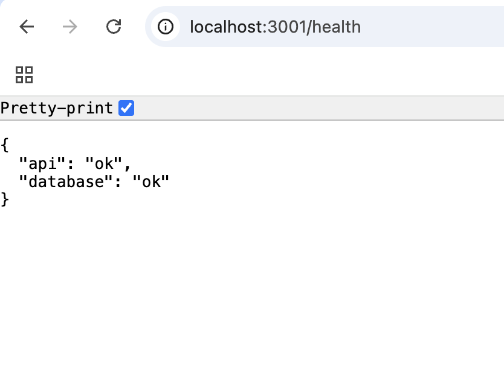
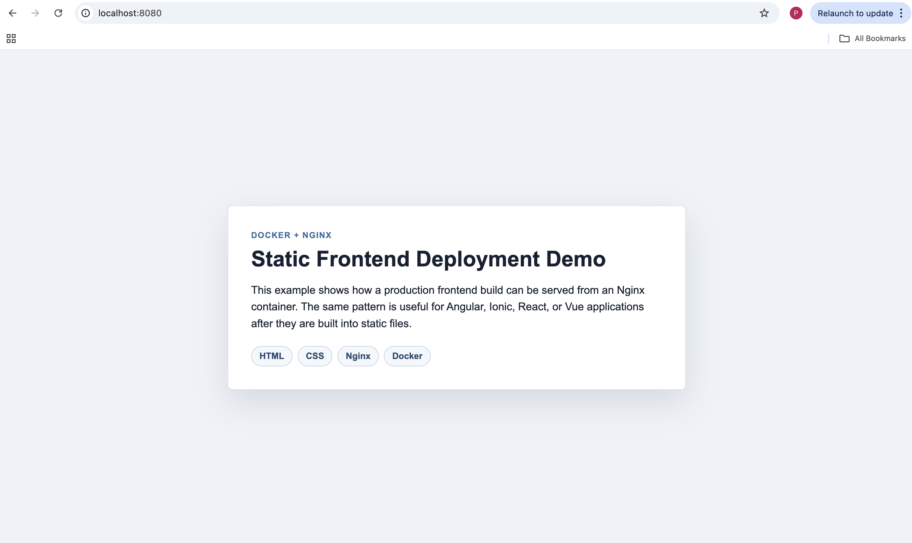

# Docker Cloud Deployment Guide

This repository is a hands-on Docker learning project focused on containerising applications, running services locally with Docker Compose, and connecting Docker workflows to cloud deployment concepts.

The project is organised as a short learning path. Each module introduces one practical Docker concept and includes runnable code, commands, cleanup steps, and screenshots.

## Learning Outcomes

By working through this project, I practised how to:

- Build Docker images from Dockerfiles
- Run application containers locally
- Map container ports to localhost
- Use Docker Compose for multi-container applications
- Connect a Node.js API to PostgreSQL
- Use service names, environment variables, health checks, and volumes
- Serve static frontend files with Nginx
- Document cloud deployment concepts using App Engine and Cloud Build notes
- Troubleshoot common Docker issues using logs and container status

## Learning Path

| Module | Topic | What It Demonstrates |
|---|---|---|
| 01 | Basic Node.js Docker App | Dockerfile, image build, container run, health endpoint |
| 02 | Docker Compose + PostgreSQL | API + database, service networking, volumes, health checks |
| 03 | Static Frontend with Nginx | Frontend hosting using an Nginx container |
| 04 | Cloud Deployment Notes | App Engine, Cloud Build, and Docker troubleshooting |
| 05 | Capstone Checklist | How the modules connect to a cloud-ready application |

## Repository Structure

```text
docker-cloud-deployment-guide/
  01-basic-node-app/
  02-docker-compose-postgres/
  03-static-frontend-nginx/
  04-cloud-deployment-notes/
  05-capstone-cloud-ready-app/
  docs/
  screenshots/
```

## Study Notes

- [Docker command cheat sheet](docs/docker-command-cheatsheet.md)
- [Docker glossary](docs/docker-glossary.md)
- [Capstone cloud-ready app checklist](05-capstone-cloud-ready-app/README.md)

## Module 01 - Basic Node.js Docker App

A minimal Express API containerised with a Dockerfile.

Skills practised:

- Dockerfile basics
- Image builds
- Container runs
- Port mapping
- Health endpoints

Run:

```bash
cd 01-basic-node-app
docker build -t basic-node-docker-app .
docker run --name basic-node-app -p 3000:3000 basic-node-docker-app
```

Open:

```text
http://localhost:3000/health
```

## Module 02 - Docker Compose With PostgreSQL

A Node.js API connected to a PostgreSQL database using Docker Compose.

Skills practised:

- Multi-container applications
- Docker Compose services
- API-to-database communication
- PostgreSQL container setup
- Health checks and database volumes

Run:

```bash
cd 02-docker-compose-postgres
docker compose up --build
```

Open:

```text
http://localhost:3001/roles
http://localhost:3001/health
```

## Module 03 - Static Frontend With Nginx

A static frontend served from an Nginx container.

Skills practised:

- Nginx static hosting
- Frontend containerisation
- Production-style static file serving
- Deployment pattern for Angular, Ionic, React, or Vue builds

Run:

```bash
cd 03-static-frontend-nginx
docker build -t static-frontend-nginx .
docker run --name static-frontend -p 8080:80 static-frontend-nginx
```

Open:

```text
http://localhost:8080
```

## Screenshots

### Basic Node.js Health Check



### Docker Compose PostgreSQL Roles Endpoint



### Docker Compose API and Database Health Check



### Static Frontend Served With Nginx



## Docker Concepts Practised

- Images package application code and dependencies.
- Containers run applications in isolated environments.
- Dockerfiles define repeatable image build steps.
- Port mappings expose container services on localhost.
- Docker Compose runs related services together.
- Service names allow containers to communicate within the same Compose network.
- Volumes preserve database data beyond a container lifecycle.
- Nginx can serve static frontend builds in a lightweight container.

## Cloud Deployment Connection

The local Docker workflows in this project connect to cloud deployment concepts:

- Dockerfiles support repeatable builds.
- Compose files help model app, database, and service dependencies.
- Health endpoints support deployment checks.
- Environment variables separate configuration from code.
- Cloud Build and App Engine workflows use similar ideas around build steps, configuration files, and deployment automation.

## Portfolio Value

This project demonstrates practical graduate-level exposure to Docker, Docker Compose, backend services, frontend hosting, cloud deployment preparation, troubleshooting, and technical documentation.

## Future Improvements

- Add GitHub Actions for automated Docker checks
- Add a `.env.example` file
- Add API tests
- Add an architecture diagram
- Add Cloud Run deployment notes
- Extend the capstone into a full frontend + API + database Compose project
